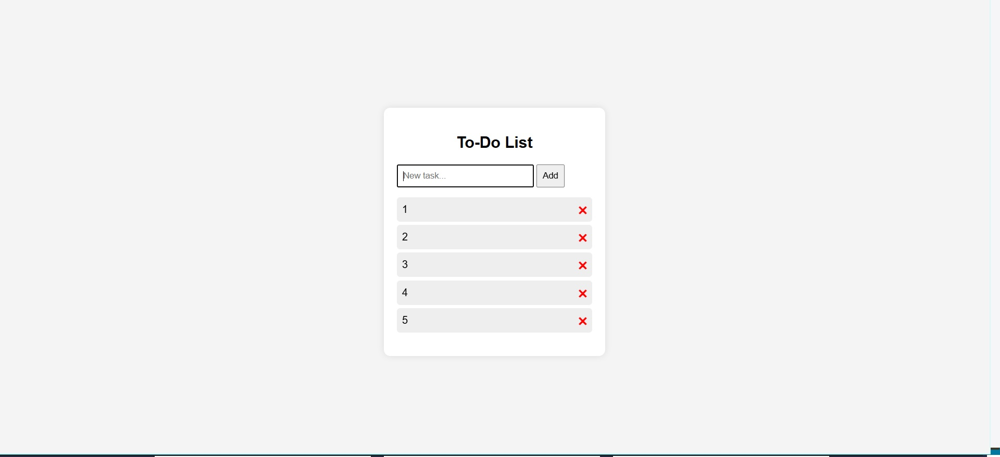

# To-Do List Website

  

## 📌 Project Overview

This is a simple and interactive To-Do List website built using HTML, CSS, and JavaScript.  
It allows users to manage daily tasks by adding, completing, and removing items. All tasks are preserved using the browser’s localStorage, so data persists after page refresh.

---

## 🚀 Features

- 📝 Add new tasks
- ✔️ Mark tasks as completed
- 🗑️ Remove tasks
- 💾 Persistent storage using localStorage
- 📱 Responsive and minimal UI

---

## 🛠️ Tech Stack

- HTML — Structure & layout
- CSS — Styling & responsiveness
- JavaScript — App logic & DOM manipulation

---

## 📁 Project Structure

To-Do-List-website/
│
├── index.html
├── script.js
├── style.css
├── README.md
└── public/
    └── todo-preview.png
---

## 📥 Installation & Usage

1. Clone the repository:

git clone https://github.com/jawasakher/To-Do-List-website.git
2. Open the project folder.
3. Launch the app by opening:

index.html
in your browser.

---

## 📸 Screenshot

Add a preview image of the application inside:

/public/todo-preview.png
This helps recruiters and users quickly see the UI.

---

## 🧠 How It Works

The app uses JavaScript to:

1. Capture user input from a text form
2. Add tasks dynamically to the list
3. Store tasks in localStorage so they remain after refresh
4. Render saved tasks when the page loads

---

## 🎯 Future Enhancements

- Add task editing capability
- Enable drag-and-drop ordering
- Add due dates & reminders
- Dark mode theme

---

## 👤 About the Developer

Jawa Sakher  
Frontend Developer interested in interactive UI and vanilla JavaScript projects.  
GitHub: https://github.com/jawasakher

---

## 📄 License

This project is licensed under the MIT License.
